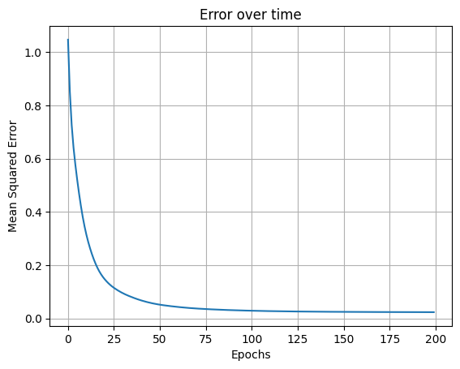

# Diamond Price Prediction

A polynomial regression model to predict diamond prices based on their characteristics. Implemented from scratch using numpy and optimized with Adam.

---

## Dataset

This project uses the [diamonds dataset](https://www.kaggle.com/datasets/shivam2503/diamonds) from Kaggle, which contains various attributes of diamonds such as carat, cut, color, clarity, and more, along with their prices.


---

## Features

- Categorical features are encoded using one-hot encoding.
- Features and target prices are normalized for better convergence.
- Polynomial feature expansion up to degree 2 for capturing non-linear relationships.
- Implemented Linear Regression training from scratch using:
  - Gradient Descent
  - Adam Optimizer (default and recommended)
- Comparison with sklearn’s Polynomial Regression model.

---

## How to Use

1. Clone the repo:
    ```bash
    git clone https://github.com/Moonlight304/Diamond-Price-Prediction.git
    cd Diamond-Price-Prediction
    ```

2. Download `diamonds.csv` from Kaggle and place it in the root folder.

3. Install dependencies:
    ```bash
    pip install numpy pandas scikit-learn matplotlib
    ```

4. Launch Jupyter Notebook:
    ```bash
    jupyter notebook
    ```

5. Open and run `main.ipynb`.

---

## Results

```
Mean Squared Error : 510923.25108463597
Mean Absolute Error : 421.32078440162206
R2 Score : 0.9687309038319147
```



- The model achieves an R² score of around **96.87%** on the test set. 
- Training loss decreases smoothly with Adam optimizer.
- Comparable performance to sklearn’s Polynomial Regression (approx 97.1%).

---


## Future Work

- Experiment with higher polynomial degrees or other regression methods.
- Implement cross-validation for better model evaluation.
- Build a user interface to input diamond attributes and get price predictions.

---

## License

MIT License
